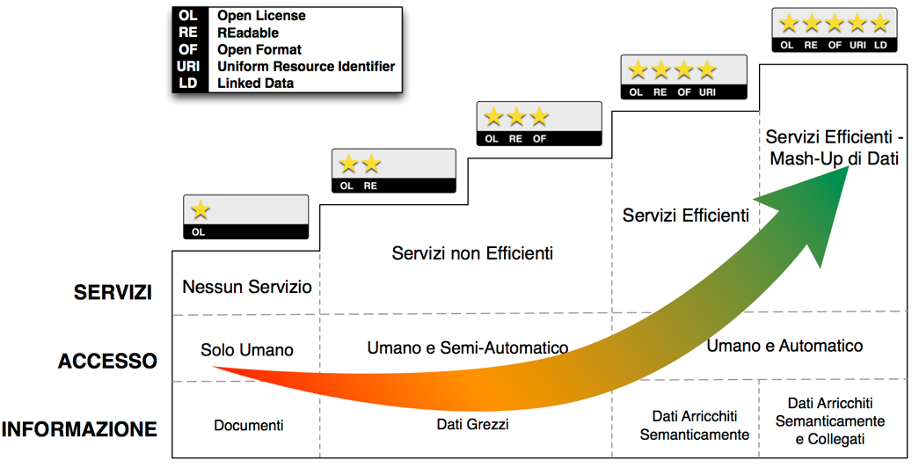

**Allegato A** - Modello per i dati aperti
------------------------------------------

Il modello da considerare per produrre e pubblicare dati aperti è quello
noto come modello a cinque stelle rappresentato in :ref:`Figura <modello-5stelle>`, che
fornisce una scala per misurare l’apertura dei dati.

   Modello a cinque stelle per i dati aperti [1]_

1. I livelli del modello per i dati aperti
~~~~~~~~~~~~~~~~~~~~~~~~~~~~~~~~~~~~~~~~~~

Per ciascun livello, di seguito vengono indicate le caratteristiche
principali in termini di informazione, accesso e servizi.

La :ref:`Figura <formati-dati-aperti>` riportata al par. :ref:`par-4-1`, indica, per ciascun formato,
il numero di stelle raggiungibile.

1.1 **Livello 1 (1 stella)**
^^^^^^^^^^^^^^^^^^^^^^^^^^^^

-  **Informazione**: Dati disponibili tramite una licenza aperta e
   inclusi in documenti leggibili e interpretabili solo grazie a un
   significativo intervento umano (per es., PDF);

-  **Accesso**: Prevalentemente umano, necessario anche per dare un
   senso ai dati inclusi nei documenti;

-  **Servizi**: Solo rilevanti interventi umani di estrazione ed
   elaborazione dei possibili dati consentono di sviluppare servizi con
   l’informazione disponibile in questo livello;

1.2 **Livello 2 (2 stelle)**
^^^^^^^^^^^^^^^^^^^^^^^^^^^^

-  **Informazione:** Dati disponibili in forma strutturata e con licenza
   aperta. Tuttavia, i formati sono proprietari (per es., Excel) e un
   intervento umano è fortemente necessario per un’elaborazione dei
   dati;

-  **Accesso:** I programmi possono elaborare i dati ma non sono in
   grado di interpretarli; pertanto è necessario un intervento umano al
   fine di scrivere programmi ad-hoc per il loro utilizzo;

-  **Servizi:** Servizi ad-hoc che devono incorporare i dati per
   consentire un accesso diretto via Web agli stessi;

1.3 **Livello 3 (3 stelle)**
^^^^^^^^^^^^^^^^^^^^^^^^^^^^

-  **Informazione**: Dati con caratteristiche del livello precedente ma
   in un formato non proprietario (per es., CSV, JSON, geoJSON). I dati
   sono leggibili da un programma ma l’intervento umano è necessario per
   una qualche elaborazione degli stessi;

-  **Accesso**: I programmi possono elaborare i dati ma non sono in
   grado di interpretarli; pertanto è necessario un intervento umano al
   fine di scrivere programmi ad-hoc per il loro utilizzo;

-  **Servizi**: Servizi ad-hoc che devono incorporare i dati per
   consentire un accesso diretto via Web agli stessi;

1.4 **Livello 4 (4 stelle)**
^^^^^^^^^^^^^^^^^^^^^^^^^^^^

-  **Informazione**: Dati con caratteristiche del livello precedente ma
   esposti usando standard W3C quali RDF e SPARQL I dati sono descritti
   semanticamente tramite metadati e ontologie;

-  **Accesso**: I programmi sono in grado di conoscere l’ontologia di
   riferimento e pertanto di elaborare i dati quasi senza ulteriori
   interventi umani;

-  **Servizi**: Servizi, anche per dispositivi mobili, che sfruttano
   accessi diretti a Web per reperire i dati di interesse;

1.5 **Livello 5 (5 stelle)**
^^^^^^^^^^^^^^^^^^^^^^^^^^^^

-  **Informazione**: Dati con caratteristiche del livello precedente ma
   collegati a quelli esposti da altre fonti (i.e., Linked Open Data). I
   dati sono descritti semanticamente tramite metadati e ontologie. Essi
   seguono il paradigma RDF, in cui alle entità è assegnato un URI
   univoco sul Web. Nel caso dei Linked Open Data l’intervento umano è
   minimo o nullo;

-  **Accesso**: I programmi sono in grado di conoscere l’ontologia di
   riferimento e pertanto di elaborare i dati quasi senza ulteriori
   interventi umani;

-  **Servizi**: Servizi, anche per dispositivi mobili, che sfruttano sia
   accessi diretti a Web sia l’informazione ulteriore catturata
   attraverso i link dei dati di interesse, facilitando il mashup di
   dati.

.. [1] Rivisitazione della `figura disponibile sul web <http://5stardata.info/en/>`__

.. forum_italia::
   :topic_id: 29848
   :scope: document
