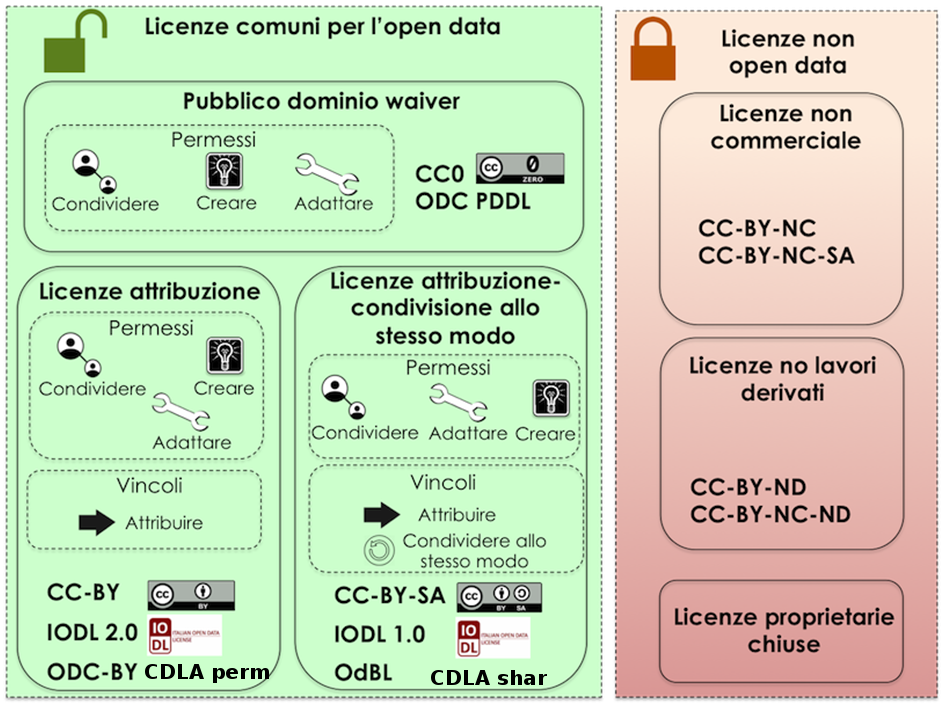

.. _par-6-1:

Licenze e condizioni di riutilizzo
~~~~~~~~~~~~~~~~~~~~~~~~~~~~~~~~~~

Una delle caratteristiche dei dati di tipo aperto - come previsto nella
definizione data dal CAD all’art. 1 comma 1 lettera l-ter - è quella di
essere “\ **disponibili secondo i termini di una licenza o di una
previsione normativa che ne permetta l’utilizzo da parte di chiunque,
anche per finalità commerciali, in formato disaggregato**\ ”.

Principio preminente indicato dal Decreto è che il riutilizzo dei
documenti non debba essere soggetto a condizioni (“*Il riutilizzo di
documenti non è soggetto a condizioni, (...)*\ ”, art. 8, comma 2); in
coerenza con tale indicazione, anche nel caso di richiesta di riutilizzo
di documenti non già “aperti” (art. 5, comma 2 del Decreto), è previsto
che “\ *in caso di decisione positiva, i documenti sono resi
disponibili, ove possibile, in forma elettronica e, se necessario,
attraverso una licenza*\ ”, sottolineando, in tal modo, indirettamente,
la possibilità di non apporre alcuna restrizione (quindi, alcuna
licenza), al riutilizzo dei dati.

Tuttavia, la Direttiva precisa che in alcuni casi giustificati da un
obiettivo di pubblico interesse, possa essere utilizzata una licenza che
impone al suo titolare condizioni di riutilizzo riguardanti
“\ *questioni quali la responsabilità, la protezione dei dati di
carattere personale, l’uso corretto dei documenti, la garanzia di non
alterazione e la citazione della fonte*\ ” (cfr. Considerando 44).

In quest’ultimo caso (applicazione di specifiche condizioni), il Decreto
stabilisce che tali condizioni debbano essere oggettive, proporzionate e
non discriminatorie, nonché giustificate da un pubblico interesse (cfr.
art. 8, comma 2).

In questo contesto, l’apposizione di una licenza, oltre a identificare e
“definire” correttamente i dati aperti, costituisce uno strumento
funzionale a garantire certezza circa l’effettiva riutilizzabilità di un
dataset o database; certezza che costituisce un presupposto essenziale
alla valorizzazione dell’informazione, specie nel settore pubblico.
Seppure, quindi, in assenza di specifica licenza operi il principio
dell’“open by default” previsto dall’art. 52 del CAD, SI RACCOMANDA di
apporre sempre una licenza ai dataset pubblicati, in modalità tali da
renderla facilmente individuabile e comprensibile.

Nel contesto sopra descritto, in particolare, il Decreto dispone
l’\ **utilizzo di licenze standard disponibili in formato digitale**
(“*Le pubbliche amministrazioni (...) adottano licenze standard,
disponibili in formato digitale, per il riutilizzo dei propri
documenti*\ ”, art. 8, comma 1). Tali licenze standard devono comunque
prevedere il minor numero possibile di restrizioni al riutilizzo
(limitando, per esempio, le restrizioni alla sola indicazione della
fonte), che consentano, pertanto, a chiunque di accedere liberamente a
dati e contenuti, nonché di utilizzarli, modificarli e condividerli
liberamente e per qualsiasi finalità.

.. admonition:: should

    **Raccomandazione 8**: dlgs36-2006/opendata/rec/licenses/attribution

    SI RACCOMANDA di restringere le condizioni di cui alla licenza apposta ai dati alla sola attribuzione.

Ricordiamo, inoltre, che, in linea con il principio che vuole
l’apposizione del minor numero possibile di restrizioni, l’art. 7 del
decreto legislativo n. 33/2013, con riferimento a documenti,
informazioni e dati oggetto di pubblicazione obbligatoria, dispone che
siano pubblicati in formato di tipo aperto “\ *senza ulteriori
restrizioni*\ **diverse dall’obbligo di citare la fonte**\ *e di
rispettarne l'integrità*\ ”.

Tale previsione è coerente con l’impostazione sopra richiamata, che vede
nella “attribuzione” l’unica condizione liberamente e sostanzialmente
apponibile al dataset/database.

SI RACCOMANDA, inoltre, di valutare sempre, nel processo di apertura,
l’eventuale impatto di ulteriori discipline che producono effetti su
quella oggi in esame, in particolare le previsioni del Regolamento UE
2016/679 e del D. Lgs. n. 196/2003 “\ *relativo alla protezione delle
persone fisiche con riguardo al trattamento dei dati personali, nonché
alla libera circolazione di tali dati*\ ”, ricordando che l’art. 4 del
Decreto fa salva tale specifica disciplina nell’utilizzo e riutilizzo di
dati.

L’utilizzo di licenze standard favorisce, infine, l’immediata
comprensibilità della stessa e l’uniformità nel suo riutilizzo.

Considerato quanto sopra esposto, quindi, si ritiene che l’apposizione
di condizioni ulteriori rispetto all’attribuzione (quale, ad esempio, la
cd. SA - “share alike” - condivisione) presentino aspetti di potenziale
criticità, oltre che pratica nel caso di uso di fonti diverse
diversamente licenziate, anche rispetto alla compatibilità con l’attuale
normativa.

.. admonition:: should

    **Raccomandazione 9**: dlgs36-2006/opendata/rec/conditions/more-conditions

    SI RACCOMANDA di limitare l’uso di licenze con condizioni ulteriori rispetto alla sola attribuzione solo ai casi strettamente necessari.

Rispetto alla specifica licenza da apporre, si rammenta che ad oggi, si
utilizzano numerose licenze standard, che possono essere suddivise in
tre gruppi:

-  **Licenze di sola attribuzione**

   -  **CC-BY**, prodotte dall’omonimo movimento internazionale
      (www.creativecommons.org) secondo diverse versioni successive;
      nella versione attuale (4.0), consente al licenziatario di
      condividere e modificare, per qualsiasi finalità, con la sola
      restrizione dell’attribuzione al licenziante. A differenza di
      precedenti versioni, le condizioni si applicano anche con
      riferimento ai diritti “sui generis" e l’attribution implica il
      richiamo di fonte, copyright etc nella misura richiamata dal
      licenziante e può essere assolta in ogni forma “ragionevole”.
      Vieta inoltre l’apposizione di restrizioni ulteriori, anche di
      natura tecnologica e richiede indicazione delle modifiche;

   -  **CDLA-permissiva 1.0** : consente al licenziatario di condividere
      e modificare, con la sola attribuzione al licenziante e citazione
      della licenza. Incoraggia l’arricchimento e il miglioramento dei
      dati e la produzione di opere derivate/mashup, senza creare
      vincoli con i dati di provenienza. Non impone obblighi o
      restrizioni ai dati “migliorati” (derivato e/o di mashup) e
      contiene il concetto di “risultato” - non condizionato - proprio
      delle elaborazioni algoritmiche;

   -  **IODL 2.0**: consente al licenziatario di condividere e
      modificare, per qualsiasi finalità, con la sola restrizione
      dell’attribuzione al licenziante, comprensiva del nome del
      soggetto che fornisce il dato, includendo, se possibile, il link
      alla licenza. Contiene riferimento alla normativa nazionale sul
      diritto d’autore e sui dati personali;

   -  **ODC-BY**: consente al licenziatario di condividere e modificare,
      per qualsiasi finalità, con la sola restrizione dell’attribuzione
      al licenziante. Prevede il diritto sui-generis, ma precisa
      espressamente che non regola anche i contenuti della banca dati.

-  **Licenze di Attribuzione e Condivisione**:

   -  **CC-BY-SA**: consente al licenziatario di condividere e
      modificare, per qualsiasi finalità, con la restrizione
      dell’attribuzione al licenziante, con la duplice restrizione
      dell’attribuzione al licenziante e della redistribuzione del
      prodotto derivato con la stessa licenza dell’originale (o versione
      successiva). Vieta l’apposizione di restrizioni ulteriori, anche
      di natura tecnologica;

   -  **CDLA - Condivisione 1.0**: consente al licenziatario di
      utilizzare e pubblicare i dati per il riutilizzo, con la duplice
      restrizione dell’attribuzione al licenziante e della pubblicazione
      con la stessa licenza. Incoraggia l’arricchimento e il
      miglioramento dei dati e la produzione di opere derivate/mashup,
      senza creare vincoli con i dati di provenienza. Impone ai dati
      “migliorati” (derivati e/o di mashup) l’uso della stessa licenza,
      ma conserva la libertà d’uso incondizionata dei “risultati";

   -  **IODL 1.0**: consente al licenziatario di condividere e
      modificare, per qualsiasi finalità, con la duplice restrizione
      dell’attribuzione al licenziante, - comprensiva del nome del
      soggetto che fornisce il dato, includendo, se possibile, il link
      alla licenza, e della condivisione del prodotto derivato o di
      mashup con la stessa licenza;

   -  **OdBl**: specifica per i database, consente al licenziatario di
      utilizzare, condividere, modificare, integrare e redistribuire il
      database, con la duplice restrizione dell’attribuzione al
      licenziante (anche per i prodotti derivati) e dell’uso della
      stessa licenza. Contempla il concetto di “produced work”, ovvero
      di elaborato dal db ma diverso da quest’ultimo, che può essere
      diversamente licenziato (salva citazione fonte). Consente
      l’apposizione di restrizioni ulteriori, anche di natura
      tecnologica, a condizione che almeno una copia rimanga sempre
      libera.

-  **Waiwer**

   -  **CC0**: come noto, non è una vera e propria licenza, ma una
      rinuncia preventiva all’esercizio dei diritti in qualsiasi modo
      previsti o connessi al diritto d’autore. Si parla, a riguardo, di
      attribuzione (o donazione) al pubblico dominio.

Oltre a quelle citate, va ricordata la **CDLA 2.0 permissive**, che si
pone al limite del waiwer, posto che richiede, di fatto, il solo
richiamo del testo della licenza (oltre a richiamare la nozione già
citata di “risultati”).

Tutte le ulteriori licenze Creative Commons sono classificabili come:

-  licenze che **NON consentono opere derivate**; o come

-  licenze che **NON consentono l’uso commerciale**.

.. admonition:: must

    **REQUISITO 19**: dlgs36-2006/opendata/req/conditions/nd-nc-licenses

    I titolari dei dati disponibili per il riutilizzo NON DEVONO:
    -	utilizzare licenze che non consentano opere derivate o uso commerciale;
    -	utilizzare licenze di tipo proprietario.

La maggior parte delle licenze suindicate sono raffigurate nella Figura
seguente.

   Licenze

Alla luce del Considerando (44) della Direttiva, le presenti
Linee Guida valutano come ragionevole motivo di pubblico interesse
l’adozione di una licenza standard omogenea, funzionale a preservare
l'interesse parimenti fondato di conservare traccia della fonte
“pubblica” del dato e in particolare per questioni attinenti
l’affidabilità dello stesso (a tutela, peraltro, anche del
riutilizzatore), l’unica condizione - in linea generale - ammissibile
sia la “attribuzione”.

.. admonition:: should

    **Raccomandazione 10**: dlgs36-2006/opendata/rec/conditions/sa

    SI RACCOMANDA di limitare l’uso della clausola di “condivisione” (“share-alike” - SA) solo ai casi in cui sia motivatamente necessaria ovvero previa verifica di impossibilità di rilascio con licenza CC BY 4.0, ad esempio, in ragione dell’uso non altrimenti gestibile di una fonte già rilasciata con licenza SA).

Particolare cautela, rispetto ai database, va utilizzata anche nella
scelta della licenza standard, nonché nella gestione
dell’“attribuzione”, in quanto le relative condizioni sono spesso
declinate in modo differente nelle differenti licenze. Inoltre, non
sempre tutte le licenze standard presentano condizioni riferite ad un
bene come una “base di dati” (si fa qui riferimento soprattutto alle
versioni delle Creative Commons precedenti alla 4.0, a quanto consta
ancora utilizzate: vedasi per i dettagli in allegato la nota espositiva
delle principali licenze).

Si ricorda, a riguardo, che le basi di dati godono di una duplice tutela
ai sensi della normativa nazionale e comunitaria, ovvero la tutela quale
opera creativa, ove ne ricorrano i presupposti, e la tutela del cosiddetto
“diritto sui generis”, che tutela “l’effort” di costituzione di una
banca dati, anche magari non creativa, da una estrazione totale o
sostanziale.

.. admonition:: should

    **Raccomandazione 11**: dlgs36-2006/opendata/rec/conditions/cc

    SI RACCOMANDA di non utilizzare le licenze Creative Commons precedenti alla 4.0, in cui tali diritti sui generis non erano citati/previsti (2.5), o erano richiamati come meramente rinunciati (3.0).

.. admonition:: should

    **Raccomandazione 12**: dlgs36-2006/opendata/rec/conditions/iodl

    SI RACCOMANDA di evitare quelle licenze che – per quanto ben impostate – presentano forti caratteristiche di localizzazione, anch’esse potenzialmente costituenti elementi di ambiguità in caso di riuso e mashup (come la IODL).

In relazione a quanto sopra riportato, tenuto conto del
contesto normativo di riferimento e delle indicazioni in tema di licenze
contenute nella Comunicazione della Commissione 2014/C - 240/01, **è
necessario, almeno per i dati aperti “nativi”  - riconducibili
essenzialmente ai dati che vengono prodotti dalle Amministrazioni
pubbliche nell’adempimento delle proprie funzioni istituzionali - fare
riferimento ad una licenza unica aperta, che garantisca la libertà di
riutilizzo, che sia internazionalmente riconosciuta e che consenta di
attribuire la paternità dei dataset (attribuire la fonte).**

.. admonition:: must

    **REQUISITO 20**: dlgs36-2006/opendata/req/conditions/ccby4

    Per i nuovi dati aperti nativi, salvo quanto precisato nel Requisito 21, DEVE essere applicata la licenza CC-BY nell’ultima versione disponibile (al momento della stesura delle presenti linee guida, la 4.0), presupponendo altresì l’attribuzione automatica di tale licenza nel caso di applicazione del principio “open data by default”, di cui all’articolo 52 del CAD.

.. admonition:: must

    **REQUISITO 21**: dlgs36-2006/opendata/req/conditions/no-ccby4

    L’adozione, qualora possibile e/o previsto, di una licenza diversa dalla CC-BY 4.0 DEVE essere formalmente motivata, anche alla luce dei principi espressi dalla Direttiva, salvo che sia stata adottata una licenza altrettanto compatibile come la CDLA 2.0 permissive e/o una licenza universalmente compatibile, o meglio un “waiwer”, come la CC0.
    L’adozione di una licenza diversa da CC-BY 4.0, CC0 o altra altrettanto compatibile non è applicabile per le serie di dati di elevato valore.

.. admonition:: should

    **Raccomandazione 13**: dlgs36-2006/opendata/rec/conditions/update

    SI RACCOMANDA ai titolari che hanno già pubblicato set di dati con licenze diverse da quelle sopra richiamate, incluse versioni della CC-BY precedente alla 4.0, di valutare il rinnovo della licenza, adeguandola alle indicazioni suddette, individuando nel caso le ragioni eventualmente impedienti tale aggiornamento.

.. topic:: Risorse utili
  :class: useful-docs

  - :mimetype:`text/html` `Joinup Licensing Assistant <https://joinup.ec.europa.eu/collection/eupl/solution/joinup-licensing-assistant/jla-find-and-compare-software-licenses>`_

  - :mimetype:`text/html` `Gestione licenze – data.europa.eu <https://data.europa.eu/it/training/licensing-assistant>`_

  - :mimetype:`text/html` `CDLA permissive compatibility <https://wiki.osmfoundation.org/wiki/CDLA_permissive_compatibility>`_

  - :mimetype:`text/html` `CDLA-Permissive-2.0 Compatibility with Other Licenses <https://cdla.dev/faq-resources/compatibility/>`_

  - :mimetype:`text/html` `Compatible Licenses, Creative Commons <https://creativecommons.org/share-your-work/licensing-considerations/compatible-licenses/>`_

  - :mimetype:`text/html` `Wiki/cc license compatibility <https://wiki.creativecommons.org/wiki/Wiki/cc_license_compatibility>`_

  - :mimetype:`text/html` `Compatibility of Creative Commons Licenses <https://learn.canvas.net/courses/4/pages/compatibility-of-creative-commons-licenses>`_

  - :mimetype:`text/html` `Italian Open Data License <https://it.wikipedia.org/wiki/Italian_Open_Data_License>`_

  - :mimetype:`text/html` `Creative Commons Licenses Compatibility Wizard <https://www.oerafrica.org/FTPFolder/Website Materials/UnderstandingOER/licwiz/english.html>`_

    .. toctree::
      :maxdepth: 3

      licenze-e-condizioni-di-riutilizzo/compatibilità-tra-licenze.rst
      licenze-e-condizioni-di-riutilizzo/buone-pratiche-approccio-open-by-design.rst
