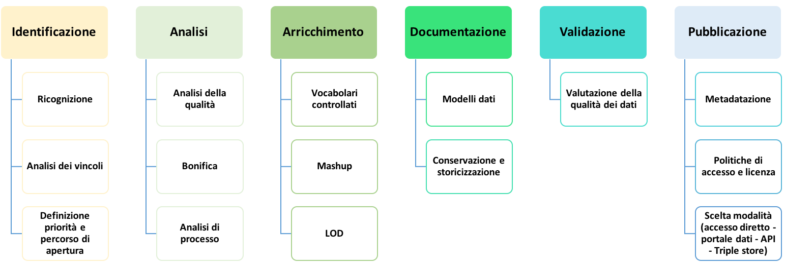

.. _par-5-1:

Aspetti organizzativi
~~~~~~~~~~~~~~~~~~~~~

Un dato destinato alla pubblicazione è frutto di una catena di processi
e una serie di attività di analisi ed elaborazione finalizzati al
miglioramento della qualità e dell’accesso al dato stesso

Nella :ref:`Figura <processo-preparazione-dati>` che segue è rappresentato un possibile percorso di
preparazione dei dati per garantirne la produzione e la pubblicazione di qualità, necessariamente elastico per l’applicazione
alle diverse realtà amministrative.

La rappresentazione di tale percorso è un adattamento dell’analogo
processo definito nel documento “\ *Data quality guidelines*\ ”
dell’Ufficio delle Pubblicazioni della Commissione Europea. Uno
schema analogo, sebbene riferito ai linked open data, è definito anche
nelle *Linee Guida per l’interoperabilità semantica attraverso i Linked
Open Data*\  [1]_. A tale proposito, **si raccomanda di seguire le
suddette Linee Guida per il processo di produzione di Linked Open
Data**.

Alcune fasi indicate nel percorso possono non essere considerate stante
il possibile diverso punto di partenza che porterà alla pubblicazione
dei dati. Se, per esempio, si tratta di produrre un nuovo dato,
quindi non ancora esistente, le attività di ricognizione e di analisi
possono essere by-passate e la prima fase da considerare potrà essere
quella della modellazione, oltre alla definizione di priorità e del
percorso di apertura (inserita nella fase di identificazione), che
rimane comunque valida.

L’applicazione del processo deve avvenire in maniera costante: **le
attività non si esauriscono con la mera pubblicazione dei dati, ove
questo sia possibile, ma devono prevedere un costante aggiornamento,
monitoraggio e coinvolgimento con gli utenti finali**, fasi non
rappresentate nel percorso ma ugualmente importanti per un’ulteriore
ottimizzazione dei dati basata sulle effettive esigenze degli utenti.

   Processo di preparazione dei dati

.. _par-5-1-1:

Ruoli e responsabilità
^^^^^^^^^^^^^^^^^^^^^^

Per attuare il processo è necessario definire innanzitutto una chiara data
*governance* interna con l’individuazione di ruoli e relative
responsabilità e integrare le sue fasi sia verticalmente, rispetto ai
processi interni già consolidati, che orizzontalmente rispetto alle
necessità delle diverse amministrazioni.

L’autonomia organizzativa delle attività di ciascuna Amministrazione non
consente di definire un modello unico per la gestione del processo di
apertura dei dati e di implementazione delle indicazioni definite nelle
presenti Linee Guida, vista anche la clausola di invarianza finanziaria
di cui all’art. 13 del Decreto. Ogni Amministrazione e, all’interno di
essa, ogni unità organizzativa possono individuare e definire **un
proprio modello procedurale che individui ruoli e responsabilità dei
soggetti coinvolti** sulla base delle disponibilità finanziarie, umane e
strumentali.

Un ruolo essenziale per l’organizzazione di uffici e risorse per il
processo di apertura e di riutilizzo dei dati può essere svolto
dall’\ **ufficio del Responsabile per la transizione digitale** (RTD)
istituito con l’art. 17 del **CAD**, che ha la responsabilità della
transizione alla modalità operativa digitale e che risponde direttamente
all’organo di vertice politico o, in assenza di questo, a quello
amministrativo dell’ente.

La Circolare n. 3 del 1° ottobre 2018 del Ministro per la pubblica
amministrazione [2]_, al fine di garantire la piena operatività
dell’Ufficio del RTD, raccomanda di prevedere, nell’atto di conferimento
dell’incarico o di nomina, oltre che i compiti espressamente previsti,
anche il **potere, tra l’altro, di costituire gruppi tematici per
singole attività e/o adempimenti** come può essere il processo di
apertura e pubblicazione dei dati.

Nel caso in cui tale potere non sia assegnato al RTD, la costituzione
del gruppo “tematico” può essere direttamente decisa dal vertice
politico o quello amministrativo.

In ogni caso, **il RTD deve essere comunque coinvolto** stante il suo
ruolo di riferimento del vertice politico e/o amministrativo e figura
trasversale a tutta l’organizzazione in potere di agire su tutti gli
uffici e aree dell’ente, da una parte, e di punto di contatto con
l’Agenzia per l’Italia Digitale e la Presidenza del Consiglio dei
Ministri, dall’altra, per le questioni connesse alla trasformazione
digitale delle pubbliche amministrazioni, come ribadito anche nella
citata Circolare n. 3/2018.

.. admonition:: should

    **Raccomandazione 4**: dlgs36-2006/opendata/req/organization/rtd

    SI RACCOMANDA di demandare al Responsabile per la transizione digitale (RTD) il compito di costituire un gruppo di lavoro dedicato al processo di apertura dei dati e all’implementazione delle presenti Linee Guida all’interno dell’organizzazione dell’Ente.
    Il RTD deve essere comunque coinvolto in tutto il suddetto processo.

Visto quanto premesso, nelle presenti linee guida si considera il
**gruppo di lavoro per i dati aperti come possibile struttura per il
governo del processo di apertura dei dati**, rimandando all’autonomia
organizzativa di ciascun ente la previsione di eventuali altre strutture
e figure, oltre all’individuazione dei compiti da assegnare ad essi.

.. admonition:: should

    **Raccomandazione 5**: dlgs36-2006/opendata/req/organization/wg

    SI RACCOMANDA di costituire, all’interno dell’organizzazione dell’Ente, un apposito gruppo di lavoro dedicato al processo di apertura dei dati anche per l’applicazione delle presenti Linee Guida, prevedendo, ove possibile, le strutture e le figure adatte e necessarie a tale scopo.

All’interno del gruppo di lavoro, o comunque nell’organizzazione
dell’ente, è bene prevedere un responsabile e il coinvolgimento dei
**responsabili e/o referenti tematici** che gestiscono e trattano dati
nell’ambito delle singole unità organizzative, oltre alle figure che
possano fornire il necessario supporto per l’analisi della qualità dei
dati, per la definizione delle interfacce di accesso ai dati, per la
promozione di applicazioni sviluppate a partire dai dati pubblicati,
fornendo anche nel caso esempi di servizi dimostrativi attraverso cui
incentivare il riutilizzo. Alcuni membri del team (per es., esperti di
tecnologie web, esperti GIS, esperti di tecnologie e strumenti per i
Linked Data) possono occuparsi della gestione del processo di apertura
del dato dal punto di vista IT.

È altresì importante garantire il **raccordo e la consultazione con le
altre figure coinvolte nel processo di digitalizzazione della pubblica
amministrazione**, ovvero responsabile per la conservazione documentale,
responsabile per la prevenzione della corruzione e la trasparenza,
responsabile per la protezione dei dati personali, responsabile dei
sistemi informativi (se non coincide con il RTD), responsabile per la
sicurezza.

L’azione di raccordo e consultazione di cui sopra può essere
espletata dal RTD a cui, sulla base della Circolare n. 3/2018 citata
innanzi, può essere deputata, nell’atto di nomina, l’adozione dei più
opportuni strumenti per garantire tale azione.

.. topic:: Risorse utili
  :class: useful-docs

  - :mimetype:`application/pdf` `Circolare del Ministro per la pubblica amministrazione n. 3 del 1° ottobre 2018 - Responsabile per la transizione digitale - art. 17 decreto legislativo 7 marzo 2005, n. 82 “Codice dell’amministrazione digitale” <https://www.funzionepubblica.gov.it/sites/funzionepubblica.gov.it/files/Circolare_n_3_10_2018.pdf>`_

.. _par-5-1-2:

Individuazione e selezione
^^^^^^^^^^^^^^^^^^^^^^^^^^

Il processo di apertura dei dati non può che partire da una ricognizione
dei dati detenuti e trattati dall’ente e la successiva identificazione e
selezione di quelli che possono essere resi disponibili per il
riutilizzo.

L’apertura può riguardare:

-  dati nativi, cioè dati generati dalle amministrazioni, perché
   prodotti dai vari uffici durante l’adempimento delle proprie funzioni
   istituzionali;

-  dati mashup, cioè dati provenienti da diverse fonti e soggetti a
   operazioni di integrazione.

In entrambi i casi, l’apertura può essere sollecitata da soggetti
esterni interessati attraverso specifiche richieste (v. par. :ref:`par-5-2`).

In questa fase sono certamente da considerare i dati che le norme
prevedono di rendere disponibili **obbligatoriamente** come dati di tipo
aperto. In particolare, tra gli altri:

-  sulla base della disposizione di cui all’art. 7 del
   [**D-LGS-33-2013**], “\ *i documenti, le informazioni e i dati
   oggetto di pubblicazione obbligatoria ai sensi della normativa
   vigente, resi disponibili anche a seguito dell'accesso civico di cui
   all’articolo 5*\ ” del medesimo decreto;

-  ai sensi dell’art. 50-quater del [**CAD**], tutti i dati acquisiti e
   generati nella fornitura dei servizi svolti in concessione da
   pubbliche amministrazioni. L’obbligo del concessionario di rendere
   disponibili all’amministrazione concedente detti dati come dati di
   tipo aperto DEVE essere inserito nei contratti e nei capitolati con i
   quali le pubbliche amministrazioni affidano lo svolgimento dei
   servizi in concessione.

Per i nuovi dati che rientrano nell’ambito di applicazione del Decreto,
il processo di produzione e pubblicazione deve essere guidato dal
principio dell’\ **apertura fin dalla progettazione e per impostazione
predefinita**, come, tra l’altro, disposto dall’art. 6 comma 4 del
Decreto. A tale proposito, nel par. :ref:`par-6-1-2` sono definite una serie di
raccomandazioni per applicare il principio dell’ “open data by design”.

**Ricognizione -** Per i dati nativi, all’interno dei singoli uffici o
dei vari settori dell’amministrazione vanno quindi individuati quali
dati, tra tutti quelli prodotti, si vogliono rendere aperti anche per
abilitare nuove forme di riutilizzo dell’informazione in quanto utili
all’esterno. Per i dati mashup, le amministrazioni possono raccogliere e
integrare informazioni da diverse fonti interne ed esterne che
concorrono alla formazione del dato. Per tale tipologia di dati, la
parte più importante è la definizione delle modalità di accesso a
partire dalle politiche dei singoli produttori dei dati e le relative
modalità di rilascio e aggiornamento dei dati.

**Analisi dei vincoli giuridici -** Alla fase di ricognizione fa seguito
l’analisi giuridica delle fonti del dato, fondamentale per garantire
sostenibilità nel tempo del processo di produzione e pubblicazione dei
dati considerando i possibili vincoli che possono impedire o limitare
(anche temporalmente) l’apertura di dati e documenti, evidenziando
limitazioni d’uso, finalità di competenza, determinazione dei diritti e
dei termini di licenza.

Per supportare tale analisi, si riporta di seguito una breve “check
list”, utile per verificare se tutti gli aspetti giuridici siano stati
valutati.

+-----------------------------------+-----------------------------------+
| **Aspetto**                       | **Domanda**                       |
+-----------------------------------+-----------------------------------+
| Privacy                           | i dati sono liberi da ogni        |
|                                   | informazione che possa            |
|                                   | identificare in modo diretto o    |
|                                   | indiretto l’individuo (nome,      |
|                                   | cognome, indirizzo, codice        |
|                                   | fiscale, patente, telefono,       |
|                                   | email, foto, descrizione fisica,  |
|                                   | caratteristiche personali, ecc.)? |
|                                   | In caso negativo queste           |
|                                   | informazioni sono autorizzate per |
|                                   | legge?                            |
+-----------------------------------+-----------------------------------+
| Privacy                           | i dati sono liberi da ogni        |
|                                   | informazione sensibile            |
|                                   | riconducibile all’individuo o da  |
|                                   | ogni informazione relativa al     |
|                                   | soggetto che incrociata con dati  |
|                                   | comunemente reperibili nel web    |
|                                   | (per es. google maps,linked data, |
|                                   | ecc.) possa identificare          |
|                                   | l’individuo? In caso negativo     |
|                                   | queste informazioni sono          |
|                                   | autorizzate per legge?            |
+-----------------------------------+-----------------------------------+
| Privacy                           | i dati sono liberi da ogni        |
|                                   | riferimento a profughi, protetti  |
|                                   | di giustizia, vittime di violenze |
|                                   | o in ogni caso categorie          |
|                                   | protette?                         |
+-----------------------------------+-----------------------------------+
| Privacy                           | hai considerato il rischio di     |
|                                   | de-anonimizzazione del tuo        |
|                                   | dataset prima di pubblicarlo?     |
+-----------------------------------+-----------------------------------+
| Privacy                           | esponi dei servizi di ricerca     |
|                                   | tali da poter filtrare i dati in  |
|                                   | modo da ottenere un solo record   |
|                                   | geolocalizzato, che sia           |
|                                   | facilmente riconducibile ad una   |
|                                   | persona fisica?                   |
+-----------------------------------+-----------------------------------+
| Proprietà intellettuale della     | l’ente è proprietario dei dati,   |
| sorgente                          | anche se non sono stati creati    |
|                                   | direttamente da suoi dipendenti?  |
+-----------------------------------+-----------------------------------+
| Proprietà intellettuale della     | sei sicuro di non usare dati per  |
| sorgente                          | i quali vi è una licenza o un     |
|                                   | brevetto di terzi?                |
+-----------------------------------+-----------------------------------+
| Proprietà intellettuale della     | se i dati non sono del tuo ente   |
| sorgente                          | hai un accordo o una licenza che  |
|                                   | ti autorizzi a pubblicarli?       |
+-----------------------------------+-----------------------------------+
| Licenza di rilascio               | stai rilasciando i dati di cui    |
|                                   | possiedi la proprietà             |
|                                   | accompagnati da una licenza?      |
+-----------------------------------+-----------------------------------+
| Limiti alla pubblicazione         | hai verificato che non vi siano   |
|                                   | impedimenti di legge o            |
|                                   | contrattuali che per la           |
|                                   | pubblicazione dei dati?           |
+-----------------------------------+-----------------------------------+
| Limiti alla pubblicazione         | hai verificato che i dati e i     |
|                                   | documenti non siano tra quelli    |
|                                   | esclusi dall’applicazione del     |
|                                   | decreto legislativo 36/2006?      |
+-----------------------------------+-----------------------------------+
| Segretezza                        | hai verificato se non vi siano    |
|                                   | motivi di ordine pubblico o di    |
|                                   | sicurezza nazionale, motivi       |
|                                   | legati al segreto d’ufficio o al  |
|                                   | segreto di stato o al segreto     |
|                                   | statistico che ti impediscono la  |
|                                   | pubblicazione dei dati?           |
+-----------------------------------+-----------------------------------+
| Temporalizzazione                 | i dati sono soggetti per legge a  |
|                                   | restrizioni temporali di          |
|                                   | pubblicazione?                    |
+-----------------------------------+-----------------------------------+
| Temporalizzazione                 | i dati hanno dei divieti di legge |
|                                   | o giurisprudenziali che           |
|                                   | impediscono la loro               |
|                                   | indicizzazione da parte di motori |
|                                   | di ricerca?                       |
+-----------------------------------+-----------------------------------+
| Trasparenza                       | i dati rientrano nella lista      |
|                                   | dell’allegato A del d.lgs.        |
|                                   | 33/2013? Se sì come sono stati    |
|                                   | trattati dal responsabile della   |
|                                   | trasparenza nella sezione         |
|                                   | “Amministrazione trasparente”?    |
+-----------------------------------+-----------------------------------+

L’analisi dei vincoli e, quindi, la verifica sulla possibilità di rendere disponibili i dati per il riutilizzo possono
essere ulteriormente supportate prendendo in considerazione l’elenco dei
documenti esclusi dall’applicazione del Decreto riportato nel par.
:ref:`par-1-2`. Se il dato o documento rientra tra uno di quelli dell’elenco di
cui sopra, allora è da escludere dai dati da rendere disponibili come
dati aperti.

**Definizione priorità e percorso di apertura** - La ricognizione dei
dati consente di avere contezza del patrimonio informativo, mentre
l’analisi dei vincoli consente di fare una prima selezione dei dati che
possono essere resi disponibili per il riutilizzo. Per i dati non
soggetti a vincoli, è necessario individuare criteri e modalità di
apertura anche in base ad una eventuale **scala di priorità** basata,
per esempio, su un approccio di tipo “demand-driven” che tenga conto
dell’impatto economico e sociale nonché del livello di interesse e delle
necessità degli utilizzatori.

Alcuni criteri da considerare per assegnare la priorità nell’apertura
potrebbero essere:

-  le tipologie di dati individuate dal Decreto a cui è riconosciuto un
   enorme potenziale economico, quindi dati dinamici, serie di dati di
   elevato valore e dati della ricerca;

-  le richieste pervenute dai riutilizzatori sulla base dell’art. 5 del
   Decreto e della procedura di cui al par. :ref:`par-5-2`;

-  i dati che le norme prevedono di rendere disponibili
   obbligatoriamente come dati di tipo aperto (v. par. :ref:`par-5-1-2`).

Tale attività potrebbe essere sistematizzata attraverso la definizione
di un **percorso di apertura dei dati** da inserire nel Piano Triennale
ICT che ciascuna amministrazione, secondo la roadmap definita dalle
Linee d’Azione nel Piano triennale nazionale e le modalità operative
fornite da AgID, è chiamata a definire anche utilizzando il format PT
reso disponibile da AgID stessa. La predisposizione di tale Piano
rientra tra i compiti che la Circolare n. 3/2018 del Ministro per la
pubblica amministrazione raccomanda di assegnare al RTD.

A tale proposito, si fa presente che le linee d’azione del Piano
Triennale nazionale relative al capitolo sui dati includono, tra
l’altro:

-  l’individuazione dei dataset di tipo dinamico da rendere disponibili
   in open data in coerenza con quanto previsto dalla Direttiva e la
   loro documentazione nel catalogo nazionale dei dati aperti;

-  la messa a disposizione dei dati territoriali attraverso i servizi di
   rete di cui a [**INSPIRE-DIR**];

-  la documentazione dei dati di tipo aperto attraverso il catalogo
   nazionale dei dati aperti (in corrispondenza del risultato atteso
   relativo all’aumento del numero di dataset di tipo aperto).

I criteri di prioritizzazione indicati innanzi, quindi, troverebbero
fondamento anche nelle azioni che gli enti devono implementare per
raggiungere gli obiettivi e i risultati attesi prefissati dal Piano
Triennale nazionale.

.. topic:: Risorse utili
 :class: useful-docs

 - :mimetype:`text/html` `Linee guida in materia di trattamento di dati personali contenuti anche in atti e documenti amministrativi effettuato da soggetti pubblici per finalità di pubblicazione e diffusione sul web, adottate con Deliberazione n. 088 del 2 marzo 2011 del Garante per la Protezione dei Dati Personali <https://www.garanteprivacy.it/web/guest/home/docweb/-/docweb-display/docweb/1793203>`_

 - :mimetype:`text/html` `Linee Guida recanti indicazioni operative ai fini della definizione delle esclusioni e dei limiti all’accesso civico di cui all’art. 5 co. 2 del D. Lgs. 33/2013 adottate con Determinazione n. 1309 del 28 dicembre 2016 dell’Autorità Nazionale Anticorruzione <https://www.anticorruzione.it/-/determinazione-n.-1309-del-28/12/2016-rif.-1?inheritRedirect=true&redirect=%2Fconsulta-i-documenti%3Fq%3D%2522Determinazione%2520n.%25201309%2522%26sort%3Dddm__Dataclu0_String_sortable->`_

 - :mimetype:`application/pdf` `Guida per la redazione format del Piano Triennale per le pubbliche amministrazioni <https://www.agid.gov.it/sites/default/files/repository_files/format_pt_-_indicazioni_operative_e_note_per_la_redazione.pdf>`_
 

.. _par-5-1-3:

Analisi
^^^^^^^

**Analisi della qualità dei dati** - All’analisi giuridica delle fonti
segue l’analisi della qualità dei dati. Per la definizione del concetto
di qualità dei dati si può ricorrere alla norma ISO/IEC 25012, secondo
cui “\ **la qualità dei dati è il grado in cui le caratteristiche dei
dati soddisfano esigenze espresse e implicite quando utilizzati in
specifiche condizioni**\ ”. Nella sezione dedicata alla “qualità dei
dati” (v. par. :ref:`par-5-3`) si identificano alcune misure e un metodo di
valutazione, basati sugli standard ISO di riferimento.

**Bonifica** - Generalmente l’analisi della qualità del dato può
richiedere una fase di bonifica, vale a dire un miglioramento che può essere ottenuto eliminando errori e criticità attraverso processi
basati sui dati, tramite il confronto con il mondo reale o il confronto
incrociato (matching) con altri dataset, oppure adottando processi di
bonifica basati sui processi che hanno la caratteristica di analizzare
le cause che hanno portato alla scarsa qualità del dato e di rivedere i
processi di produzione del dato per garantirne la qualità nel tempo.

**Analisi di processo, (re)ingegnerizzazione dei processi organizzativi
e produzione dei dati** - Ogni dato ha un proprio ciclo di vita,
caratterizzato da uno specifico tasso di aggiornamento o manutenzione.

Risulta quindi necessario **analizzare il processo organizzativo che
produce e gestisce il dato per fare in modo che la produzione di quel
dato sia consolidata e diventi stabile, secondo la frequenza di
aggiornamento e le modalità di rilascio adottate**.

È preferibile che l’aggiornamento sia operato dal titolare del dato
nativo, di prima produzione, possibilmente in coordinazione con gli
altri dipartimenti interni all’ente o agli altri enti interessati, anche
al fine di evitare duplicazioni.

.. _par-5-1-4:

Arricchimento
^^^^^^^^^^^^^

Una volta che i dati sono bonificati, possono essere arricchiti
attraverso l’integrazione con altri dati e il linking esterno.
L’arricchimento è definito dal documento “Data quality guidelines” del
Publications Office come il concetto di collegare i dati da fonti
esterne ai set di dati esistenti ed è un processo, secondo il documento,
costituito sia dalla standardizzazione che dall’arricchimento vero e
proprio.

**Vocabolari controllati** - Come indicato nel documento “Data quality
guidelines”, un livello più alto di standardizzazione può essere
raggiunto facendo riferimento a vocabolari controllati, quali elenchi di
codici, tassonomie, classificazioni o terminologie, definiti nel Piano
Triennale ICT 2017-2019 come “\ *un modo comune e condiviso per
organizzare codici e nomenclature ricorrenti in maniera standardizzata e
normalizzata*\ ”. I vocabolari controllati assegnano ad ogni concetto un
identificatore univoco e persistente (URI), in modo che quel concetto
venga referenziato in maniera non ambigua, e garantiscono, inoltre, la
gestione in modo coerente delle diverse versioni. Possono essere
associate, oltre alle etichette, definizioni e descrizioni anche in diverse
lingue.

I vocabolari fanno sì che invece di utilizzare nei dati le etichette,
queste possano essere referenziate dagli identificatori univoci
assegnati, in modo che, se le etichette dovessero cambiare, il
riferimento non deve essere adeguato, riducendo l’onere di manutenzione
per i titolari di dati. Considerato, inoltre, che gli URI possono essere
deferenziati (v. par. :ref:`par-7-1-3`), ciò consente di risolvere l’etichetta
in qualsiasi lingua supportata dal vocabolario controllato.

In caso di dati di elevato valore (v. par. :ref:`par-4-3`), per specifiche categorie tematiche (ovvero osservazione della terra e ambiente, statistica, imprese e proprietà delle imprese, mobilità) la bozza di Regolamento UE indica esplicitamente che i set di dati devono utilizzare, ove possibile, vocabolari controllati e tassonomie documentati pubblicamente e riconosciuti nell’Unione o a livello internazionale.

AgID rende disponibili i vocabolari controllati definiti nell’ambito
della rete Ontopia [3]_ e, per i dati territoriali, del Sistema di
Registri INSPIRE Italia (v. box “Risorse utili”).

**Integrazione con altri dati -** L’arricchimento dei dati può essere
ottenuto, come detto, anche integrando informazioni da sorgenti esterne
rendendo in questo modo i dati di origine più significativi e fruibili.
Il valore aggiunto è ottenuto, per esempio, producendo i dati mashup già
citati in precedenza.

**Linked Open Data** - Come detto, il collegamento (linking) dei dati
può aumentarne il valore creando nuove relazioni e consentendo così
nuovi tipi di analisi.

Nel caso in cui il processo sia finalizzato alla produzione di linked
open data, come evidenziato nelle già citate Linee Guida per
l’interoperabilità semantica attraverso i Linked Open Data, “\ *il
linking è una funzionalità molto importante e di fatto può essere
considerata una forma particolare di arricchimento. La particolarità
consiste nel fatto che l’arricchimento avviene grazie all’interlinking
fra dataset di origine diversa, tipicamente fra amministrazioni o
istituzioni diverse, ma anche, al limite, all'interno di una stessa
amministrazione*\ ”.

Tale collegamento è possibile soprattutto attraverso l’uso coerente di
identificatori univoci, gli URI, di cui si è parlato prima e che vengono
approfonditi ulteriormente nel par. :ref:`par-7-1-3`.

I linked data, oltre agli URI, utilizzano diversi standard e tecniche,
tra cui il framework RDF, e risorse come i vocabolari controllati, di
cui si è detto innanzi, il cui utilizzo ottimale può essere ottenuto
facendo riferimento a formati di dati a quattro stelle come le
serializzazioni RDF o il JSON-LD. Nell’allegato B sono riportati, nella
prima parte, anche i principali standard di riferimento necessari anche
ad abilitare i livelli 4 e 5 del modello dei dati di cui all’allegato A.

Utilizzando il framework RDF, si può costruire un grafo semantico, noto
anche come grafo della conoscenza, che può essere percorso dalle
macchine risolvendo, cioè dereferenziando, gli URI HTTP. Ciò significa
che è possibile estrarre automaticamente informazione e derivare,
quindi, contenuto informativo aggiuntivo (inferenza).

Alcune delle fasi indicate nel percorso di cui alla :ref:`Figura <processo-preparazione-dati>` possono
essere comuni al processo di produzione dei Linked Open Data. Tale
processo è caratterizzato da altre specifiche fasi, non rappresentate nel percorso
comune, ma dettagliate nelle Linee Guida citate innanzi a cui si
rimanda, come già raccomandato in precedenza. È importante notare che
nella pratica si ritiene a volte necessario passare da modelli di
rappresentazione tradizionali come quello relazionale per la
modellazione dei dati operando opportune trasformazioni per poi renderli
disponibili secondo i principi dei Linked Open Data. Tuttavia, tale
pratica non è necessariamente quella più appropriata: esistono
situazioni per cui può essere più conveniente partire da un’ontologia
del dominio e che si intende modellare e dall’uso di standard del web
semantico per poter governare i processi di gestione dei dati.

.. topic:: Risorse utili
 :class: useful-docs

 - :mimetype:`application/pdf` `Linee Guida sull’interoperabilità semantica attraverso i Linked Open Data <https://www.agid.gov.it/sites/default/files/repository_files/documentazione_trasparenza/cdc-spc-gdl6-interoperabilitasemopendata_v2.0_0.pdf>`_

 - :mimetype:`text/html` `Ontopia – vocabolari controllati <https://github.com/italia/daf-ontologie-vocabolari-controllati/tree/master/VocabolariControllati>`_

 - :mimetype:`text/html` `Sistema di Registri INSPIRE Italia <https://registry.geodati.gov.it/>`_
 
 
.. _par-5-1-5:

Documentazione
^^^^^^^^^^^^^^

Una fase molto importante nel processo di preparazione dei dati è la
definizione di sintassi (cioè struttura) e semantica (cioè contenuto).
Questo, oltre a migliorare l’interoperabilità, la qualità e a
facilitarne l’elaborazione, aumenta anche il valore dei dati stessi,
poiché l’interpretazione errata dei dati diventa meno probabile quando
viene fornito il contesto.

Come detto innanzi, questa fase può corrispondere alla prima del
processo nel caso il dato ancora non esista e, quindi, si parte dalla
definizione di un’ontologia o comunque di un modello dati del dominio,
cioè dalla definizione sintattica e semantica dei dati in termini di
entità rappresentate, loro attributi e associazioni (cosiddetta fase di
modellazione).

Rientra in questa fase anche la documentazione delle modifiche e degli
aggiornamenti dei dati oltre alla gestione delle relative versioni e la
storicizzazione.

**Modelli dati -** Il Piano Triennale ICT 2017-2019 definisce
un’ontologia o un modello dati condiviso come “\ *una
concettualizzazione esaustiva e rigorosa nell’ambito di un dato
dominio*\ ”.

Anche per garantire la coerenza tra i documenti, si richiama qui la fase
denominata “Semantica” nel processo digitale individuato e descritto
nelle Linee Guida per l’interoperabilità tecnica, in cui si evidenzia
che la comunicazione tra soggetti DEVE utilizzare modelli dati
condivisi, in modo da razionalizzare e uniformare la rappresentazione
dell’informazione quale presupposto per favorire l’interoperabilità tra
soggetti differenti.

Le Linee Guida di cui sopra hanno già definito una serie di requisiti in
tema di modelli dati. Come indicato nel documento citato, pertanto,
nell’individuazione delle entità da condividere i diversi soggetti
DEVONO:

1) Individuare i domini di interesse e in essi determinare le entità da
   rappresentare in termini di proprietà che li caratterizzano;

2) Verificare la presenza delle entità per dominio tra quelli definiti a
   livello nazionale da AgID nella rete di ontologie e vocabolari
   controllati Ontopia [4]_.

Ad integrazione di quanto sopra, considerato quanto previsto dall’art. 6
comma 9 del Decreto, per i dati territoriali i modelli dati da
considerare sono quelli definiti nell’ambito delle attività di
regolamentazione derivanti da **INSPIRE-DIR** e nell’ambito del
framework nazionale che fa riferimento ai decreti 10/11/2011 e alle
attività di estensione delle regole INSPIRE (v. par. :ref:`par-4-5`).

Si aggiunge, pertanto, un ulteriore requisito:

3) Nel caso di dati territoriali, verificare la presenza delle entità
   per dominio tra quelli definiti a livello europeo e nazionale
   nell’ambito della regolamentazione INSPIRE e la sua estensione
   nazionale.

Come indicato nelle citate Linee Guida, successivamente all’attuazione
delle regole 2) e 3) ci si può trovare in uno dei seguenti casi:

a) tutte le entità e le relative proprietà trovano copertura;

b) almeno una delle entità non è compresa nelle rappresentazioni;

c) almeno una proprietà di un’entità presente non risulta rappresentata.

Nel caso a), il soggetto ha tutti gli elementi per rappresentare il
proprio modello dati; viceversa, nei casi b) e c), la stessa
amministrazione, in accordo con AgID, valuta l’opportunità di estendere
il modello dati a livello nazionale.

La regola che, in generale, deve guidare è di esaminare modelli dati,
ontologie e vocabolari controllati esistenti per verificare se i
concetti hanno già entità, proprietà e, ove presenti, URI ampiamente
adottati, specie se in ambito europeo. Solo in caso contrario, l’ente
che pubblica i dati può definire e pubblicare il proprio modello dati,
ontologia o vocabolario controllato al fine di definire concetti che non
sono stati specificati altrove.

In caso di dati di elevato valore (v. par. :ref:`par-4-3`), per tutte le categorie tematiche tranne quella relativa ai dati geospaziali (per la quale si applicano i modelli dati INSPIRE), la bozza di Regolamento UE indica esplicitamente che i set di dati devono essere descritti in una documentazione online completa e pubblicamente disponibile che contenga almeno la definizione della struttura e della semantica dei dati.

**Conservazione e storicizzazione** - I dataset rilasciati costituiscono
non solo una risorsa per la collettività, ma un prezioso patrimonio
anche per le pubbliche amministrazioni che possono in questo modo
archiviare in modo alternativo i loro dati in modalità indipendente
dagli applicativi software originali che li hanno prodotti. Per questo
motivo è importante premunirsi di un sistema di
archiviazione/conservazione che mantenga le diverse versioni dei dati
nel lungo periodo. A tal fine si raccomanda di assicurare che le
versioni stesse siano accessibili a un URL stabile, che sia anche
documentato unitamente alla pubblicazione del dato.

A tale proposito, il Decreto stabilisce che le pubbliche
amministrazioni e gli organismi di diritto pubblico debbano utilizzare
le modalità per facilitare la conservazione dei documenti disponibili
per il riutilizzo secondo quanto previsto dall’articolo 44 del **CAD**.

.. topic:: Risorse utili
 :class: useful-docs

 - :mimetype:`text/html` `Ontopia – rete ontologie <https://github.com/italia/daf-ontologie-vocabolari-controllati>`_

 - :mimetype:`application/pdf` `Linee Guida sulla formazione, gestione e conservazione dei documenti informatici, adottate con la Determinazione AgID n. 407/2020 come modificate con la Determinazione AgID n. 371/2021 <https://www.agid.gov.it/sites/default/files/repository_files/linee_guida_sul_documento_informatico.pdf>`_

 - :mimetype:`application/pdf` `Regolamento sui criteri per la fornitura dei servizi di conservazione dei documenti informatici, adottato con la Determinazione AgID n. 455/2021 del 25 giugno 2021 <https://trasparenza.agid.gov.it/archivio28_provvedimenti-amministrativi_0_122919_725_1.html>`_
 
 
.. _par-5-1-6:

Validazione
^^^^^^^^^^^

La validazione dei dati è una parte essenziale di qualsiasi attività di
gestione dei dati stessi, prima che questi vengano pubblicati e utilizzati.

Essa viene definita come “\ *un’attività volta a verificare se il valore
di un dato proviene dall’insieme dato (finito o infinito) di valori
accettabili*\ ” o “\ *come un processo che assicura la corrispondenza
dei dati finali (pubblicati) con una serie di caratteristiche
qualitative*\ ” [5]_.

In sintesi, lo scopo della validazione dei dati è quello di assicurare
un certo livello di qualità ai dati stessi.

Di analisi di qualità dei dati si è già accennato nella fase post
ricognizione dei dati e, come già innanzi, si rimanda al par. :ref:`par-5-3`
dedicato alle caratteristiche e alle misure della qualità.

La fase di validazione può essere un ulteriore passaggio per la verifica
dei dati a valle delle altre operazioni effettuate prima della
pubblicazione, per es. per l’arricchimento. Può essere anche intesa come
la prima e unica fase del processo per la verifica della qualità nel
caso di nuovi dati che, quindi, non rientrerebbero nella fase di
ricognizione e nella conseguente analisi.

.. _par-5-1-7:

Pubblicazione
^^^^^^^^^^^^^

Prima di procedere alla pubblicazione è necessario creare i metadati,
definire le politiche di accesso e il modello di licenza da applicare e
identificare i canali per la pubblicazione, anche in base alla tipologia
dei dati, tra accesso diretto (del singolo dataset e/o in blocco),
portale dati, API e, in caso di linked open data, triple store.

Nella scelta del canale si devono tenere in considerazione anche i
requisiti definiti nelle presenti linee guide; i dati dinamici e le
serie di dati di elevato valore, come disposto dal Decreto, devono
essere resi disponibili attraverso API e, ove possibile, attraverso
download in blocco. Il che non significa che non possano essere resi
disponibili anche attraverso altri canali.

Il Capitolo :ref:`cap-7` fornisce indicazioni, raccomandazioni e ulteriori
elementi per la pubblicazione dei dati.

**Metadatazione** - Come detto precedentemente la metadatazione è
cruciale: i metadati certificano le caratteristiche del dato. Si ricorda
a tal riguardo di seguire i profili di metadati indicati nel paragrafo
:ref:`par-4-6` a cui si rimanda e che consentono di specificare i più
importanti metadati descrittivi per i dataset (per es., soggetti e
relativi ruoli, contestualizzazione geografica e temporale, licenza,
frequenza di aggiornamento, aspetti di distribuzione, punto di contatto,
ecc.).

**Politiche di accesso e licenza** - Altro aspetto importante da
considerare sono eventuali forme di aggregazione dei dati e restrizioni
di accesso, che hanno anche un impatto sulla scelta della licenza, per
cui si rimanda al Capitolo :ref:`cap-6`.

Sebbene sia sconsigliato restringere l’accesso ai dati o procedere con
la pubblicazione di aggregazioni degli stessi (in generale non è
opportuno che l’esposizione del dato lavorato avvenga senza che sia
stato pubblicato prioritariamente il dato grezzo), esistono casi in cui
i dati possono essere diffusi solo in forma anonima (ad esempio i
redditi), ossia a un livello di aggregazione tale da impedire di
identificare le persone cui i dati si riferiscono. A tal fine, è bene
definire delle politiche di accesso ai dati in cui sia indicato un
profilo di accesso specifico per ogni dato, dettato dai diritti
sull’informazione di base, dalle norme o dalle policy in atto.
  

.. [1] https://www.agid.gov.it/sites/default/files/repository_files/documentazione_trasparenza/cdc-spc-gdl6-interoperabilitasemopendata_v2.0_0.pdf

.. [2] https://www.funzionepubblica.gov.it/articolo/dipartimento/01-10-2018/circolare-n3-del-2018

.. [3] Tale risorsa confluirà nel Catalogo Nazionale Dati per l’interoperabilità semantica, il cui rilascio, secondo quanto indicato nel Piano Triennale 2021-2023, è previsto nell’anno corrente.

.. [4] https://github.com/italia/daf-ontologie-vocabolari-controllati. Tale risorsa confluirà nel Catalogo Nazionale Dati per l’interoperabilità semantica, il cui rilascio, secondo quanto indicato nel Piano Triennale 2021-2023, è previsto per l’anno corrente.

.. [5] Definizioni riportate nel documento “Methodology for data validation 1.1” (v. https://ec.europa.eu/eurostat/cros/system/files/ess_handbook_-_methodology_for_data_validation_v1.1_-_rev2018_0.pdf)

.. forum_italia::
   :topic_id: 29830
   :scope: document
